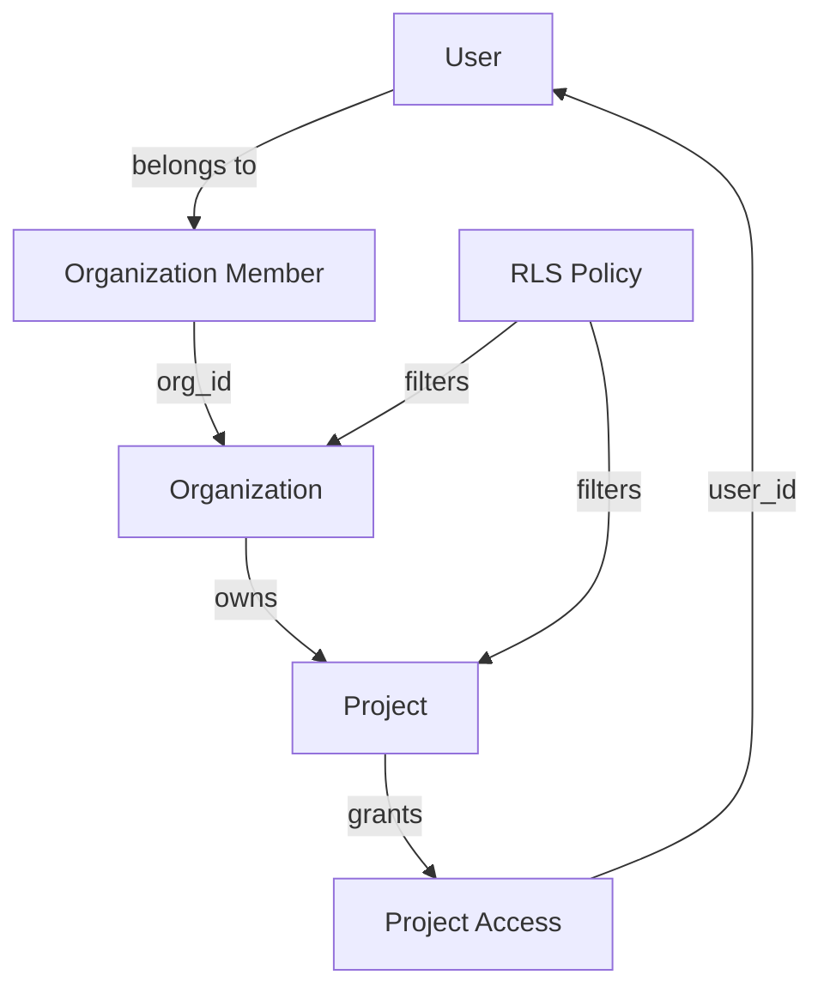

# Project Structure & OpenSpec Review

## Executive Summary

**Overall Assessment**: ✅ **Excellent** - Your dev has set up OpenSpec correctly and the project structure follows best practices.

**Key Findings**:
- ✅ OpenSpec is properly configured and being used correctly
- ✅ File structure follows Next.js 14 App Router conventions
- ✅ Good separation of concerns (lib/, components/, app/)
- ⚠️ Some tasks in progress - tracking system recommended
- 💡 Several optimization opportunities identified below

---

## 1. OpenSpec Usage Analysis

### ✅ What's Working Well

#### **1.1 Change Structure** (`add-project-foundation`)
Your current change follows OpenSpec conventions perfectly:

```
openspec/changes/add-project-foundation/
├── proposal.md          ✅ Well-structured (Why, What, Impact)
├── tasks.md             ✅ Comprehensive 99-item checklist
├── design.md            ✅ Detailed technical decisions
└── specs/
    ├── auth/spec.md     ✅ Properly formatted ADDED requirements
    └── tenancy/spec.md  ✅ (170+ requirements with scenarios)
```

**Strengths**:
- All spec scenarios use correct `#### Scenario:` format (4 hashtags)
- Requirements use normative language (SHALL/MUST)
- Design decisions are well-documented with rationale and alternatives
- Proposal clearly states impact and affected specs
- Tasks are numbered and organized by phase

#### **1.2 Spec Delta Format**
Your auth spec is exemplary:

```markdown
## ADDED Requirements
### Requirement: User Registration
The system SHALL allow new users to register with email and password.

#### Scenario: Successful registration with email confirmation
- **WHEN** a user provides valid email and password
- **THEN** the system creates a user account in pending state
- **AND** sends a confirmation email
```

This is **perfect** - exactly what OpenSpec expects.

#### **1.3 Design Document**
Your `design.md` is comprehensive and includes:
- Context and stakeholders
- Goals / Non-Goals (critical for scope control)
- Detailed decisions with rationale
- Alternatives considered
- Risks and mitigations
- Migration plan
- Open questions with answers

This is **production-grade documentation**.

---

### ⚠️ Areas for Improvement

#### **2.1 Specs Directory is Empty**
```bash
openspec/specs/  # Empty - no specs yet
```

**Why**: This is expected since you haven't archived the `add-project-foundation` change yet.

**Action Required**:
Once you complete all tasks in `tasks.md`, you should archive the change:

```bash
# After all tasks are done and deployed
openspec archive add-project-foundation --yes

# This will:
# 1. Move changes/add-project-foundation/ → changes/archive/2025-01-XX-add-project-foundation/
# 2. Create specs/auth/spec.md and specs/tenancy/spec.md (from your deltas)
# 3. Update project state to reflect what IS built (not just proposed)
```

#### **2.2 Task Tracking**
Your `tasks.md` has 99 unchecked items:

```markdown
## 1. Project Initialization
- [ ] 1.1 Initialize Next.js 14...
- [ ] 1.2 Configure TypeScript strict mode...
...
```

**Recommendation**: Use one of these approaches:

**Option A: Manual tracking in tasks.md**
```bash
# Check off tasks as you complete them
- [x] 1.1 Initialize Next.js 14 ✅
- [x] 1.2 Configure TypeScript strict mode ✅
- [ ] 1.3 Set up Prettier with config file (IN PROGRESS)
```

**Option B: Use Claude Code's TodoWrite tool**
When working on tasks, use the TodoWrite tool to track progress:
- Keeps todos visible in Claude Code UI
- Shows active task status
- Helps prevent losing track of work

**Option C: Create GitHub Issues**
For team collaboration:
```bash
# Convert tasks to GitHub issues
gh issue create --title "1.1: Initialize Next.js 14" --label "foundation"
```

#### **2.3 Validation Not Run**
**Action**: Validate your change before continuing:

```bash
openspec validate add-project-foundation --strict

# This checks:
# - All requirements have scenarios
# - Scenario format is correct (#### Scenario:)
# - No duplicate requirement names
# - Proper ADDED/MODIFIED/REMOVED sections
```

If you get errors, the `--json` flag helps debug:
```bash
openspec show add-project-foundation --json --deltas-only
```

---

## 2. File Structure Analysis

### ✅ Current Structure (Excellent)

```
construction-work-os/
├── app/                        ✅ Next.js 14 App Router
│   ├── (auth)/                 ✅ Route group for auth pages
│   │   ├── login/
│   │   ├── signup/
│   │   ├── confirm/
│   │   ├── forgot-password/
│   │   ├── reset-password/
│   │   └── magic-link/
│   ├── (dashboard)/            ✅ Route group for protected pages
│   │   ├── [orgSlug]/          ✅ Dynamic org routing
│   │   ├── dashboard/
│   │   └── orgs/
│   ├── auth/callback/          ✅ OAuth callback handler
│   ├── layout.tsx              ✅ Root layout
│   ├── page.tsx                ✅ Home page
│   └── globals.css             ✅ Global styles
├── components/                 ✅ React components
│   ├── ui/                     ✅ shadcn/ui components
│   │   ├── button.tsx
│   │   ├── card.tsx
│   │   ├── dialog.tsx
│   │   ├── dropdown-menu.tsx
│   │   ├── input.tsx
│   │   ├── label.tsx
│   │   ├── select.tsx
│   │   ├── badge.tsx
│   │   ├── toast.tsx
│   │   └── toaster.tsx
│   ├── providers/              ✅ Context providers
│   │   └── query-provider.tsx
│   ├── app-header.tsx          ✅ Layout components
│   ├── logout-button.tsx
│   └── org-switcher.tsx
├── lib/                        ✅ Shared utilities
│   ├── actions/                ✅ Server Actions
│   ├── schemas/                ✅ Zod validation schemas
│   │   ├── auth.ts
│   │   ├── organization.ts
│   │   └── index.ts
│   ├── supabase/               ✅ Supabase clients
│   ├── test-utils/             ✅ Testing utilities
│   ├── types/                  ✅ TypeScript types
│   ├── utils/                  ✅ Helper functions
│   │   └── __tests__/          ✅ Unit tests
│   └── utils.ts                ✅ cn() helper
├── supabase/                   ✅ Database migrations
│   ├── migrations/
│   └── .temp/
├── hooks/                      ✅ Custom React hooks
│   └── use-toast.ts
├── public/                     ✅ Static assets
├── scripts/                    ✅ Utility scripts
│   └── apply-migrations.ts
├── e2e/                        ✅ Playwright E2E tests
│   ├── auth.spec.ts
│   └── navigation.spec.ts
├── openspec/                   ✅ Spec-driven development
│   ├── project.md              ✅ Project conventions
│   ├── AGENTS.md               ✅ OpenSpec instructions
│   ├── changes/                ✅ Active proposals
│   │   ├── add-project-foundation/
│   │   └── archive/            ✅ Completed changes
│   └── specs/                  ⚠️ Empty (archive to populate)
├── .claude/                    ✅ Claude Code commands
│   └── commands/
│       └── openspec/
│           ├── proposal.md     ✅ /openspec:proposal command
│           ├── apply.md        ✅ /openspec:apply command
│           └── archive.md      ✅ /openspec:archive command
├── .github/workflows/          ✅ CI/CD
├── middleware.ts               ✅ Next.js middleware
├── tailwind.config.ts          ✅ Tailwind config
├── components.json             ✅ shadcn/ui config
├── vitest.config.ts            ✅ Vitest config
├── playwright.config.ts        ✅ Playwright config
├── DESIGN_SYSTEM.md            ✅ Design documentation
├── LANDING_PAGE_MARKETING_PLAN.md ✅ Marketing plan
└── README.md                   ✅ Project README
```

**Assessment**: This is a **professional, well-organized** structure following Next.js 14 best practices.

---

### 💡 Optimization Opportunities

#### **3.1 Missing Directories (Mentioned in Spec)**

Based on your `tasks.md` and `design.md`, you may want to add:

```bash
# Create missing directories proactively
mkdir -p lib/audit          # Audit logging utilities
mkdir -p lib/queries        # React Query query functions
mkdir -p components/layout  # Layout-specific components
mkdir -p components/forms   # Form components (reusable)
mkdir -p app/api/v1         # REST API for external integrations
```

**Rationale**:
- `lib/audit/` - Task 5.4 mentions audit log helpers
- `lib/queries/` - Separate read queries from Server Actions
- `components/layout/` - Sidebar, navigation, headers
- `components/forms/` - Reusable form components (RFI, submittal, etc.)
- `app/api/v1/` - Design.md mentions REST API for integrations

#### **3.2 Add `.gitkeep` Files to Empty Directories**

```bash
# Keep empty directories in git
touch lib/audit/.gitkeep
touch lib/queries/.gitkeep
touch components/layout/.gitkeep
touch components/forms/.gitkeep
```

This prevents issues where teammates don't see the intended structure.

#### **3.3 Add Index Files for Barrel Exports**

```bash
# lib/actions/index.ts
export * from './auth'
export * from './organizations'
export * from './projects'

# lib/schemas/index.ts (you already have this ✅)

# components/ui/index.ts
export { Button } from './button'
export { Card } from './card'
// ... etc
```

**Benefit**: Cleaner imports
```tsx
// Before
import { Button } from '@/components/ui/button'
import { Card } from '@/components/ui/card'

// After
import { Button, Card } from '@/components/ui'
```

#### **3.4 Add Architecture Diagram**

Your `tasks.md` mentions creating an architecture diagram (12.5). Recommend:

```bash
# Create docs directory for architecture artifacts
mkdir -p docs/architecture
touch docs/architecture/data-model.mmd       # Mermaid diagram
touch docs/architecture/auth-flow.mmd        # Auth sequence diagram
touch docs/architecture/rls-policies.md      # RLS policy docs
```

Example Mermaid diagram:


---

## 3. OpenSpec Best Practices Checklist

### ✅ You're Already Doing

- [x] Using verb-led change IDs (`add-project-foundation`)
- [x] Writing comprehensive proposals (Why, What, Impact)
- [x] Creating design.md for complex changes
- [x] Using proper scenario format (`#### Scenario:`)
- [x] Including at least one scenario per requirement
- [x] Documenting alternatives considered
- [x] Listing affected specs and code
- [x] Creating detailed tasks.md with numbered items
- [x] Using ADDED for new capabilities (auth, tenancy)

### 📋 Recommendations Going Forward

#### **For Future Changes:**

**1. Smaller Changes When Possible**
Your current change is large (99 tasks). For future changes:

```bash
# Instead of one huge change:
add-project-foundation (99 tasks)

# Consider breaking into smaller changes:
add-auth-foundation (20 tasks)
add-tenancy-foundation (15 tasks)
add-base-ui (10 tasks)
add-ci-cd (8 tasks)
```

**Benefit**: Easier to review, test, and archive incrementally.

**Exception**: Foundation changes like yours are often unavoidably large.

**2. Archive Promptly After Deployment**
Don't let changes sit in `changes/` after they're deployed:

```bash
# After deploying auth flows:
openspec archive add-project-foundation --yes

# This keeps specs/ in sync with production reality
```

**3. Use MODIFIED Correctly**
When modifying existing requirements (future changes):

```markdown
## MODIFIED Requirements
### Requirement: User Registration
[Paste ENTIRE requirement from specs/auth/spec.md, then edit]

#### Scenario: Original scenario (keep this)
...

#### Scenario: New scenario you're adding
...
```

**Common mistake**: Only pasting the new parts. This causes data loss during archiving.

**4. Validate Before Requesting Review**

```bash
# Always run before sharing proposals
openspec validate [change-id] --strict

# Fix all errors before asking for approval
```

**5. Track Implementation Progress**
Update `tasks.md` as you go:

```markdown
## 1. Project Initialization
- [x] 1.1 Initialize Next.js 14 ✅ (Completed 2025-01-20)
- [x] 1.2 Configure TypeScript strict mode ✅
- [ ] 1.3 Set up Prettier ⏳ (In progress)
- [ ] 1.4 Add .editorconfig
```

Use symbols:
- `✅` = Done
- `⏳` = In progress
- `🚧` = Blocked
- `❌` = Skipped/Removed from scope

---

## 4. Next.js 14 App Router Specific Recommendations

### ✅ What You're Doing Right

1. **Route Groups**: Using `(auth)` and `(dashboard)` to organize without affecting URLs ✅
2. **Dynamic Routes**: `[orgSlug]` for multi-tenant routing ✅
3. **Middleware**: `middleware.ts` at root for session management ✅
4. **Server Components by Default**: No unnecessary `'use client'` directives ✅

### 💡 Optimizations

#### **4.1 Add Loading States**
```tsx
// app/(dashboard)/[orgSlug]/loading.tsx
export default function Loading() {
  return <ProjectListSkeleton />
}
```

#### **4.2 Add Error Boundaries**
```tsx
// app/(dashboard)/[orgSlug]/error.tsx
'use client'

export default function Error({ error, reset }: {
  error: Error & { digest?: string }
  reset: () => void
}) {
  return (
    <div>
      <h2>Something went wrong!</h2>
      <button onClick={reset}>Try again</button>
    </div>
  )
}
```

#### **4.3 Add Not Found Pages**
```tsx
// app/(dashboard)/[orgSlug]/not-found.tsx
export default function NotFound() {
  return <h2>Organization not found</h2>
}
```

#### **4.4 Add Metadata**
```tsx
// app/(dashboard)/[orgSlug]/layout.tsx
import { Metadata } from 'next'

export async function generateMetadata({ params }): Promise<Metadata> {
  return {
    title: `${params.orgSlug} Dashboard | Construction Work OS`,
  }
}
```

---

## 5. Supabase Integration Recommendations

### ✅ What You're Doing Right

1. **SSR Package**: Using `@supabase/ssr` ✅
2. **Client/Server Separation**: Separate client instances ✅
3. **RLS Policies**: Database-level security ✅
4. **Middleware Session Refresh**: Automatic token refresh ✅

### 💡 Optimizations

#### **5.1 Add Type Safety for Database**

Generate TypeScript types from your Supabase schema:

```bash
# Install Supabase CLI (if not already)
npm install -g supabase

# Generate types
supabase gen types typescript --project-id [YOUR_PROJECT_ID] > lib/types/database.types.ts
```

Then use in queries:
```typescript
import { Database } from '@/lib/types/database.types'

const supabase = createClient<Database>()
const { data } = await supabase.from('projects').select('*')
// data is now fully typed!
```

#### **5.2 Add Database Query Helpers**

```typescript
// lib/supabase/queries.ts
import { createClient } from './server'

export async function getUserOrgs(userId: string) {
  const supabase = createClient()
  return supabase
    .from('organizations')
    .select('*, organization_members!inner(role)')
    .eq('organization_members.user_id', userId)
}
```

**Benefit**: Centralized queries, easier to test, reusable.

#### **5.3 Add Migration Helpers**

```bash
# Create migration helper script
cat > scripts/create-migration.ts << 'EOF'
#!/usr/bin/env tsx

import { execSync } from 'child_process'
import { writeFileSync } from 'fs'

const name = process.argv[2]
if (!name) {
  console.error('Usage: npm run migration:create <name>')
  process.exit(1)
}

const timestamp = new Date().toISOString().replace(/[-:]/g, '').split('.')[0]
const filename = `supabase/migrations/${timestamp}_${name}.sql`

writeFileSync(filename, `-- Migration: ${name}\n-- Created: ${new Date().toISOString()}\n\n`)
console.log(`Created migration: ${filename}`)
EOF

chmod +x scripts/create-migration.ts
```

Add to package.json:
```json
{
  "scripts": {
    "migration:create": "tsx scripts/create-migration.ts",
    "migration:apply": "tsx scripts/apply-migrations.ts"
  }
}
```

---

## 6. Testing Infrastructure Recommendations

### ✅ What You Have

- Vitest for unit tests ✅
- Playwright for E2E tests ✅
- React Testing Library ✅
- Test utilities directory ✅

### 💡 Add These

#### **6.1 Test Coverage Configuration**

```typescript
// vitest.config.ts
export default defineConfig({
  test: {
    coverage: {
      provider: 'v8',
      reporter: ['text', 'json', 'html'],
      exclude: [
        'node_modules/',
        '.next/',
        '**/*.spec.ts',
        '**/*.test.ts',
      ],
      thresholds: {
        lines: 80,
        functions: 80,
        branches: 80,
        statements: 80,
      },
    },
  },
})
```

#### **6.2 Add Test Fixtures**

```typescript
// lib/test-utils/fixtures.ts
export const mockOrg = {
  id: '123e4567-e89b-12d3-a456-426614174000',
  name: 'Acme Construction',
  slug: 'acme-construction',
  created_at: '2025-01-01T00:00:00Z',
}

export const mockProject = {
  id: '223e4567-e89b-12d3-a456-426614174000',
  org_id: mockOrg.id,
  name: 'Sunset Tower',
  number: 'P-00001',
  status: 'active',
}

export const mockUser = {
  id: '323e4567-e89b-12d3-a456-426614174000',
  email: 'test@example.com',
}
```

#### **6.3 Add Supabase Mocks**

```typescript
// lib/test-utils/supabase-mock.ts
import { vi } from 'vitest'

export const createMockSupabaseClient = () => ({
  from: vi.fn(() => ({
    select: vi.fn().mockReturnThis(),
    insert: vi.fn().mockReturnThis(),
    update: vi.fn().mockReturnThis(),
    delete: vi.fn().mockReturnThis(),
    eq: vi.fn().mockReturnThis(),
    single: vi.fn().mockResolvedValue({ data: null, error: null }),
  })),
  auth: {
    getUser: vi.fn().mockResolvedValue({ data: { user: null }, error: null }),
  },
})
```

#### **6.4 Add GitHub Actions for Tests**

```yaml
# .github/workflows/test.yml
name: Test

on: [push, pull_request]

jobs:
  test:
    runs-on: ubuntu-latest
    steps:
      - uses: actions/checkout@v4
      - uses: actions/setup-node@v4
        with:
          node-version: '20'
      - run: npm ci
      - run: npm run type-check
      - run: npm run lint
      - run: npm run test
      - run: npx playwright install --with-deps
      - run: npm run test:e2e
```

---

## 7. Security & Compliance Recommendations

### ✅ What's Already Covered in Your Spec

- RLS policies ✅
- Audit logging ✅
- httpOnly cookies ✅
- CSRF protection ✅
- Rate limiting ✅

### 💡 Additional Recommendations

#### **7.1 Add Security Headers**

```typescript
// middleware.ts
export function middleware(request: NextRequest) {
  const response = NextResponse.next()

  // Security headers
  response.headers.set('X-Frame-Options', 'DENY')
  response.headers.set('X-Content-Type-Options', 'nosniff')
  response.headers.set('Referrer-Policy', 'strict-origin-when-cross-origin')
  response.headers.set('Permissions-Policy', 'camera=(), microphone=(), geolocation=()')

  // Your existing session refresh logic
  // ...

  return response
}
```

#### **7.2 Add Content Security Policy**

```typescript
// next.config.js
const securityHeaders = [
  {
    key: 'Content-Security-Policy',
    value: `
      default-src 'self';
      script-src 'self' 'unsafe-eval' 'unsafe-inline';
      style-src 'self' 'unsafe-inline';
      img-src 'self' blob: data: https:;
      font-src 'self';
      connect-src 'self' https://*.supabase.co;
    `.replace(/\s{2,}/g, ' ').trim()
  }
]

module.exports = {
  async headers() {
    return [
      {
        source: '/:path*',
        headers: securityHeaders,
      },
    ]
  },
}
```

#### **7.3 Add Environment Variable Validation**

```typescript
// lib/env.ts
import { z } from 'zod'

const envSchema = z.object({
  NEXT_PUBLIC_SUPABASE_URL: z.string().url(),
  NEXT_PUBLIC_SUPABASE_ANON_KEY: z.string().min(1),
  SUPABASE_SERVICE_ROLE_KEY: z.string().min(1).optional(),
})

export const env = envSchema.parse(process.env)
```

Then in your code:
```typescript
import { env } from '@/lib/env'

const supabase = createClient(env.NEXT_PUBLIC_SUPABASE_URL, env.NEXT_PUBLIC_SUPABASE_ANON_KEY)
```

---

## 8. Documentation Recommendations

### ✅ What You Have

- README.md ✅
- DESIGN_SYSTEM.md ✅
- LANDING_PAGE_MARKETING_PLAN.md ✅
- OpenSpec project.md ✅

### 💡 Add These

#### **8.1 CONTRIBUTING.md**

```markdown
# Contributing to Construction Work OS

## Development Setup

1. Clone the repo
2. Copy `.env.local.example` to `.env.local`
3. Run `npm install`
4. Run `npm run dev`

## Creating Changes

All features require OpenSpec proposals:

\`\`\`bash
# 1. Create a new change
mkdir -p openspec/changes/add-your-feature/{specs/capability-name}

# 2. Write proposal.md, tasks.md, and spec deltas

# 3. Validate
openspec validate add-your-feature --strict

# 4. Get approval before implementation

# 5. Implement tasks sequentially

# 6. Archive after deployment
openspec archive add-your-feature --yes
\`\`\`

## Running Tests

\`\`\`bash
npm run test          # Unit tests
npm run test:e2e      # E2E tests
npm run type-check    # TypeScript
npm run lint          # ESLint
\`\`\`

## Code Style

- Use TypeScript strict mode
- Follow OpenSpec conventions
- Write tests for new features
- Update specs when behavior changes
```

#### **8.2 API.md (Future)**

Document your Server Actions and REST endpoints:

```markdown
# API Reference

## Server Actions

### `createOrganization(formData: FormData)`

Creates a new organization and adds the user as owner.

**Input**:
- `name`: string (required)
- `slug`: string (optional, auto-generated if not provided)

**Returns**:
```typescript
{ data: Organization, error: null } | { data: null, error: Error }
```

**RLS**: User must be authenticated
```

---

## 9. Performance Optimization Checklist

### For MVP

- [ ] Add indexes mentioned in design.md:
  - `organizations(slug)`
  - `projects(org_id, status)`
  - `project_access(project_id, user_id)`
  - `organization_members(user_id, org_id)`
- [ ] Enable Postgres query logging in Supabase dashboard
- [ ] Monitor slow queries (>100ms) and optimize
- [ ] Use `select('id, name')` instead of `select('*')` when possible
- [ ] Add React Query staleTime to reduce refetches:
  ```typescript
  useQuery({
    queryKey: ['projects', orgId],
    queryFn: fetchProjects,
    staleTime: 60_000, // Don't refetch for 1 minute
  })
  ```

### For Post-MVP

- [ ] Add materialized view for user_project_memberships (if RLS slow)
- [ ] Implement pagination for large lists (projects, RFIs)
- [ ] Add virtual scrolling for tables (TanStack Table)
- [ ] Optimize images (Next.js Image component)
- [ ] Add CDN for static assets (Vercel does this automatically)

---

## 10. Monitoring & Observability

### Recommended Additions

#### **10.1 Add Sentry**

```bash
npm install @sentry/nextjs
npx @sentry/wizard@latest -i nextjs
```

```typescript
// sentry.client.config.ts
import * as Sentry from '@sentry/nextjs'

Sentry.init({
  dsn: process.env.NEXT_PUBLIC_SENTRY_DSN,
  environment: process.env.NODE_ENV,
  tracesSampleRate: 0.1,
})
```

#### **10.2 Add PostHog** (Mentioned in project.md)

```bash
npm install posthog-js
```

```typescript
// lib/analytics/posthog.ts
import posthog from 'posthog-js'

if (typeof window !== 'undefined') {
  posthog.init(process.env.NEXT_PUBLIC_POSTHOG_KEY!, {
    api_host: 'https://app.posthog.com',
  })
}

export { posthog }
```

Track events:
```typescript
import { posthog } from '@/lib/analytics/posthog'

posthog.capture('project_created', {
  org_id: orgId,
  project_id: projectId,
})
```

#### **10.3 Add Vercel Analytics**

```bash
npm install @vercel/analytics
```

```typescript
// app/layout.tsx
import { Analytics } from '@vercel/analytics/react'

export default function RootLayout({ children }) {
  return (
    <html>
      <body>
        {children}
        <Analytics />
      </body>
    </html>
  )
}
```

---

## 11. Specific Actionable Next Steps

### Immediate (This Week)

1. **Validate your current change**
   ```bash
   openspec validate add-project-foundation --strict
   ```
   Fix any errors before continuing.

2. **Create missing directories**
   ```bash
   mkdir -p lib/audit lib/queries components/layout components/forms app/api/v1
   touch lib/audit/.gitkeep lib/queries/.gitkeep
   ```

3. **Update tasks.md** as you complete items
   ```markdown
   - [x] 1.1 Initialize Next.js 14 ✅
   - [x] 1.2 Configure TypeScript strict mode ✅
   ```

4. **Add environment variable validation**
   ```bash
   # Create lib/env.ts with Zod schema (see section 7.3)
   ```

5. **Generate Supabase types**
   ```bash
   supabase gen types typescript --project-id [YOUR_ID] > lib/types/database.types.ts
   ```

### Short Term (Next 2 Weeks)

6. **Add loading/error states**
   - Create `loading.tsx` in route segments
   - Create `error.tsx` in route segments

7. **Add test coverage configuration**
   - Update `vitest.config.ts` with thresholds (see 6.1)

8. **Add security headers**
   - Update `middleware.ts` (see 7.1)
   - Add CSP to `next.config.js` (see 7.2)

9. **Write unit tests for RLS helpers**
   - Test `user_org_ids()` function
   - Test `user_project_ids()` function

10. **Set up CI/CD**
    - Create `.github/workflows/test.yml` (see 6.4)

### Medium Term (Before MVP Launch)

11. **Archive the change**
    ```bash
    # After all tasks complete and deployed
    openspec archive add-project-foundation --yes
    ```

12. **Add monitoring**
    - Install Sentry (see 10.1)
    - Install PostHog (see 10.2)
    - Add Vercel Analytics (see 10.3)

13. **Write CONTRIBUTING.md**
    - Document OpenSpec workflow
    - Include setup instructions

14. **Add database indexes**
    - Run `EXPLAIN ANALYZE` on common queries
    - Add indexes for slow queries

15. **Performance audit**
    - Run Lighthouse
    - Check Core Web Vitals
    - Optimize images and fonts

---

## 12. Common Pitfalls to Avoid

### ❌ Don't Do This

1. **Modifying specs/ directly**
   - ❌ Edit `specs/auth/spec.md` directly
   - ✅ Create a change in `changes/update-auth/` with MODIFIED delta

2. **Skipping validation**
   - ❌ Implement without running `openspec validate`
   - ✅ Validate before, during, and after implementation

3. **Using partial MODIFIED requirements**
   - ❌ Only paste the new scenario under MODIFIED
   - ✅ Paste the entire requirement, then add new scenario

4. **Creating changes for bug fixes**
   - ❌ Create `changes/fix-login-bug/`
   - ✅ Fix directly, no OpenSpec change needed for bugs

5. **Using application-layer auth instead of RLS**
   - ❌ Check user permissions in API routes
   - ✅ Rely on RLS policies (defense-in-depth)

6. **Hard-coding API URLs**
   - ❌ `const url = 'https://abc123.supabase.co'`
   - ✅ Use environment variables with validation

7. **Forgetting to archive changes**
   - ❌ Leave completed changes in `changes/` indefinitely
   - ✅ Archive after deployment to keep specs/ current

---

## 13. Questions to Ask Your Dev

1. **What's the current status of `add-project-foundation`?**
   - Which tasks are complete?
   - Which are in progress?
   - Any blockers?

2. **Have you run `openspec validate`?**
   - Any validation errors?
   - How did you resolve them?

3. **When do you plan to archive this change?**
   - After all 99 tasks complete?
   - Or breaking into smaller archives?

4. **Are the Supabase migrations idempotent?**
   - Can they run multiple times safely?
   - Do they have rollback scripts?

5. **How are you tracking task completion?**
   - Manually in tasks.md?
   - GitHub Issues?
   - Other tool?

---

## 14. Summary & Grade

### Overall Grade: **A** (Excellent)

**Strengths**:
- ✅ OpenSpec is properly configured and used correctly
- ✅ File structure follows Next.js 14 best practices
- ✅ Comprehensive design documentation
- ✅ Spec scenarios are properly formatted
- ✅ Good separation of concerns
- ✅ TypeScript strict mode enabled
- ✅ Testing infrastructure in place
- ✅ CI/CD foundation ready

**Areas for Improvement**:
- ⚠️ Need to validate the change (`openspec validate`)
- ⚠️ Track task completion in tasks.md
- ⚠️ Add missing directories (lib/audit, lib/queries, etc.)
- ⚠️ Archive change when complete
- ⚠️ Add monitoring (Sentry, PostHog)

**Risk Level**: **Low** - Your foundation is solid. Follow the recommendations above to maintain quality as you build.

---

## 15. Quick Reference

### OpenSpec Commands
```bash
openspec list                          # Show active changes
openspec list --specs                  # Show existing specs
openspec show add-project-foundation   # View change details
openspec validate add-project-foundation --strict  # Validate
openspec archive add-project-foundation --yes      # Archive after deploy
```

### Development Commands
```bash
npm run dev           # Start dev server
npm run build         # Production build
npm run type-check    # TypeScript check
npm run lint          # ESLint
npm run test          # Vitest unit tests
npm run test:e2e      # Playwright E2E tests
```

### Database Commands
```bash
# Generate types
supabase gen types typescript --project-id [ID] > lib/types/database.types.ts

# Run migrations (when you create the script)
npm run migration:create my-migration
npm run migration:apply
```

---

**Next Action**: Run `openspec validate add-project-foundation --strict` and share the output. This will confirm everything is properly formatted before you continue implementation.

Let me know if you have questions about any of these recommendations!
